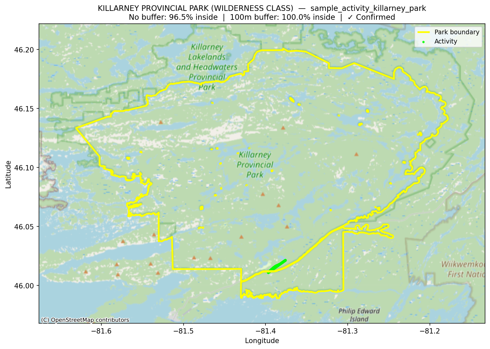

# Garmin GPS Activity × Park Boundaries
This proof of concept (POC) Python project reads Garmin .fit files and checks them against Canadian provincial park boundaries to determine whether an activity took place within a specific park.

This POC was the first step in a larger project:
[Analyzing Recreational GPS Activity Within Park Boundaries Using Python and Geospatial Analytics](https://github.com/ITNurse/garmin-activity-parkmap)

---

## The Question This POC Answers

> *Can we reliably determine whether a recorded GPS activity from a Garmin smart watch took place inside a
> specific Canadian provincial park, using only open data and Python?*

---

## What It Does

1. Parses a `.fit` Garmin GPS activity file
2. Loads provincial park boundaries (GeoJSON format)
3. Automatically adjusts the map settings so distance measurements are accurate in metres
4. Reports what percentage of GPS points fall inside the park boundary (with and without a configurable buffer)
5. Renders a map of the track overlaid on the park boundary and saves it as a PNG

---

## Repository Structure

```
garmin_project_POC/
├── outputs/
│   └── sample_activity_killarney_park__KILLARNEY_PROVINCIAL_PARK__WILDERNESS_CLASS_    # Generated plot
├── ontario_provincial_park_regulated.geojson                                           # Ontario provincial park boundaries (open data)
├── sample_activity_killarney_park.fit                                                  # Sample activity in killarney provincial park in Ontario
├── poc_visualize_track_in_park.py
├── requirements.txt
└── README.md
```

---

## Setup

**Prerequisites:** Python 3.11+

```bash
# 1. Clone the repo
git clone https://github.com/your-username/garmin_project_POC.git
cd garmin_project_POC

# 2. Create and activate a virtual environment
python -m venv venv
venv\Scripts\activate        # Windows
# source venv/bin/activate   # macOS/Linux

# 3. Install dependencies
pip install -r requirements.txt
```

---

## Usage

```bash
# Basic — will prompt you to select a park interactively
python poc_visualize_track_in_park.py sample_activity_killarney_park.fit ontario_provincial_park_regulated.geojson

# Specify the park directly
python poc_visualize_track_in_park.py sample_activity_killarney_park.fit ontario_provincial_park_regulated.geojson --park "KILLARNEY PROVINCIAL PARK (WILDERNESS CLASS)"

# Adjust buffer and threshold, skip interactive window
python poc_visualize_track_in_park.py sample_activity_killarney_park.fit ontario_provincial_park_regulated.geojson --park "KILLARNEY PROVINCIAL PARK (WILDERNESS CLASS)" --buffer 100 --threshold 90 --no-show
```

### All options

| Argument | Default | Description |
|---|---|---|
| `track` | *(required)* | Path to `.fit` activity file |
| `parks` | *(required)* | Path to park boundaries (`.geojson`) |
| `--park` | *(prompts)* | Park name — partial, case-insensitive match |
| `--name-field` | auto-detected | Column containing park names |
| `--buffer` | `50` | Buffer distance in metres |
| `--threshold` | `95.0` | Min % of points inside to confirm a visit |
| `--output-dir` | `outputs/` | Folder to save the PNG |
| `--no-show` | `False` | Skip interactive plot window |

---

## Sample Output

<!-- Replace the line below with your actual output PNG once generated -->


*Green points = inside park boundary. Red points = outside. Yellow line = park boundary.*

---

## Data Sources

| File | Source |
|---|---|
| `ontario_provincial_park_regulated.geojson` | [Ontario GeoHub — Provincial Parks (Regulated)](https://geohub.lio.gov.on.ca/datasets/c5191fcd8a944eaf91920b4ed914825a_4/) |
| `sample_activity_killarney_park.fit` | Synthetic GPS activity located within Ontario's Killarney Provincial Park |

---

## Dependencies

| Package | Purpose |
|---|---|
| `fitparse` | Parse binary Garmin `.fit` files |
| `geopandas` | Spatial operations and GeoDataFrame handling |
| `shapely` | Geometry — point-in-polygon, buffering |
| `matplotlib` | Map rendering |
| `contextily` | OpenStreetMap basemap tiles |

---

## Related Project

This POC validated the core spatial logic used in the full pipeline:
[garmin_project — full repo link here](https://github.com/ITNurse/garmin-activity-parkmap)